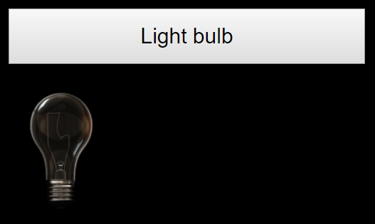
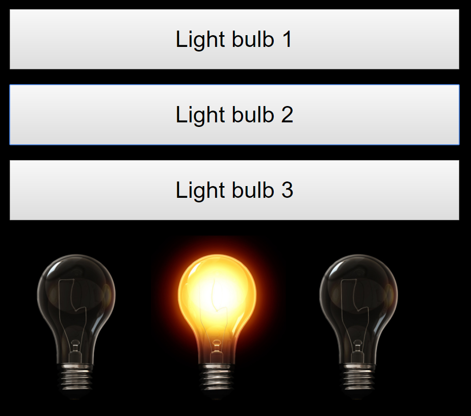
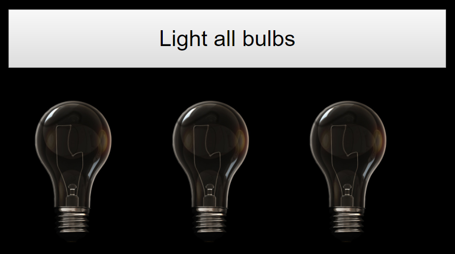
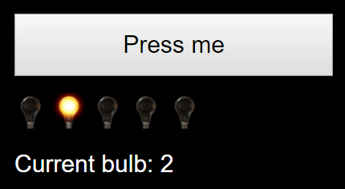
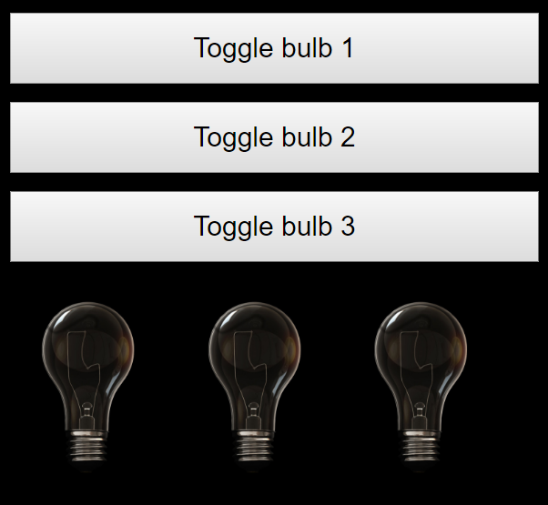
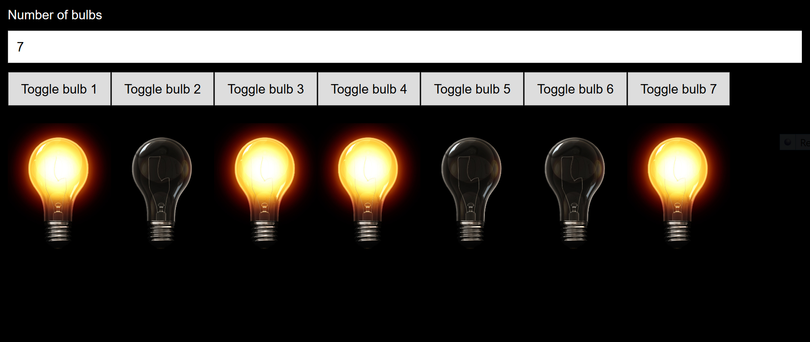

# Lampor

## Tända en lampa (bulb1.html)

Gör ett gui med en knapp och en lampa:

Lampan är släkt från början. Om användaren trycker på knappen så tänds lampan.

## Tända tre lampor (bulb2.html)

Gör ett gränsnitt med tre knappar och tre lampor:

Om en knapp trycks ner ska motsvarande lampa tändas

## Tända tre lampor - en knapp (bulb3.html)

Om användaren trycker på knappen ska alla tre lampor tändas

## Ljus som rör sig  (bulb4.html)

Rita upp en knapp och fem glödlampor

Om användaren trycker på knappen så rör sig ljuset ett steg från vänster till höger:

När ljuset är längst till höger och användaren trycker på knappen => visa den första glödlampan.

Skriv ut på skärmen vilken lampa som är tänd just nu.

## Toggla  (bulb5.html)

Tre knappar och tre lampor. 

När en knapp 1 trycks ner så tänd lampa 1 om den är släckt.

När en knapp 1 trycks ner så släck lampa 1 om den är tänd.

Samma för de andra knapparna och lamporna.

## Extra (bulb6.html)

Användaren matar in hur många lampor hen vill se. Lampor och knappar ritas upp. Så fort användaren matat in ett nytt värde så ska lamporna/knapparna uppdateras.

Om en lampa är tänd så ska den förbli tänd även om antalet lampor ändras (om de blir fler eller färre).

Om användaren trycker på en lampa => toggla den lampan.

Om användaren matar in ogiltig text (lägre än noll eller ej ett heltal) => låt lamporna/knapparna förbli som sist.

När du är klar: clean code.

Visa för din lärare!

