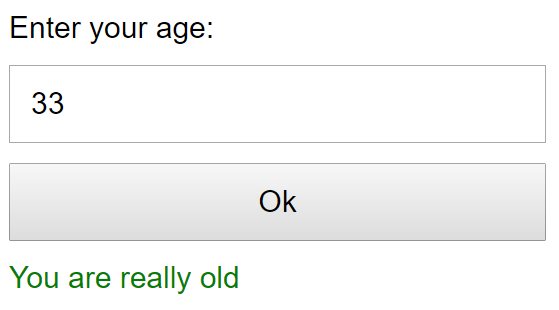

# form-age.html - Ange ålder

- Om användaren anger en ålder under 30 år => skriv "You are still young"
- Om användaren anger en ålder över 30 år => skriv "You are really old"
- Om användaren inte anger ett heltal => skriv felmeddelande

---

